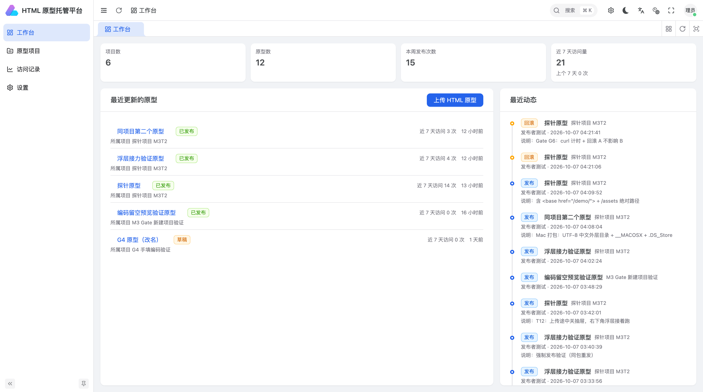
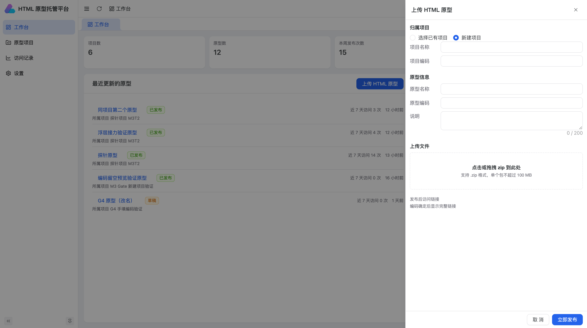
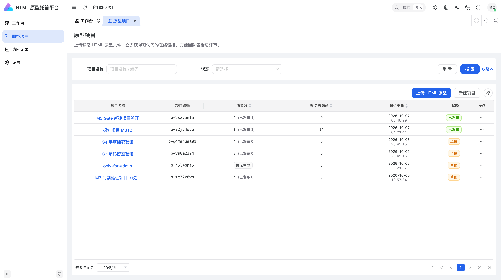
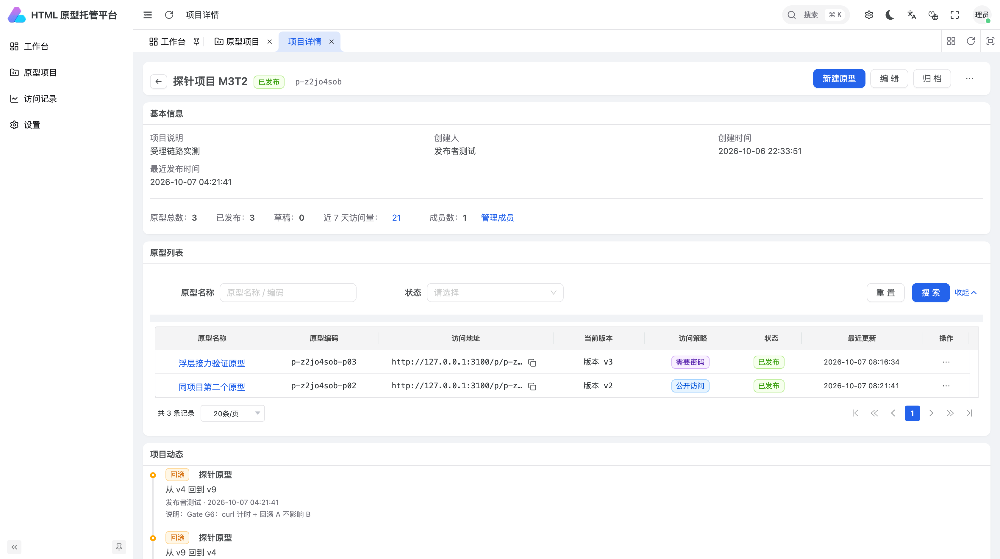
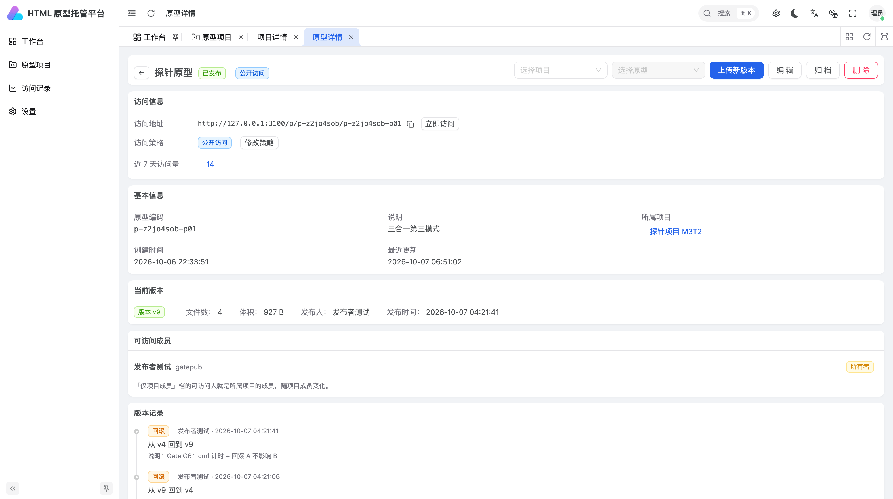
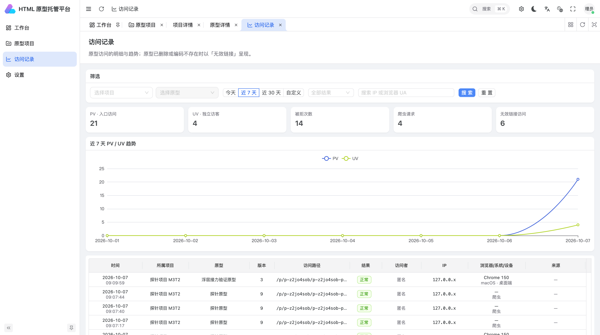
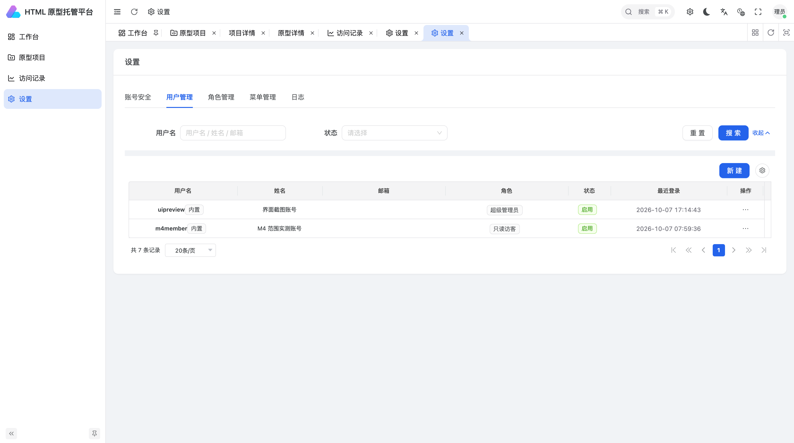
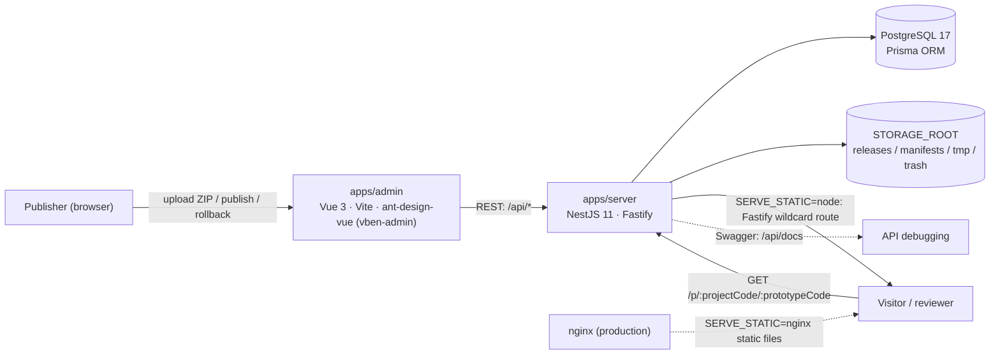

<div align="center">
  

  <h1>ProtoHub — HTML Prototype Hosting</h1>

  <p>Upload an HTML prototype ZIP, publish it as a shareable link in seconds. Manage projects, prototypes and immutable versions, with public / password / member access policies and full visit analytics.</p>

  [](./LICENSE)
  
  
  

  [English](./README.md) | **中文** ([README.zh-CN.md](./README.zh-CN.md))

  <sub>Quick start: <code>pnpm install</code> → configure env files → <code>pnpm db:migrate &amp;&amp; pnpm db:seed</code> → <code>pnpm dev</code>. Details below.</sub>
</div>

---

## Why ProtoHub

Handing a prototype to a reviewer usually means mailing a ZIP or standing up a throwaway static folder: no rollback, no access control, no idea who actually looked at it. ProtoHub turns that into a product:

- **Upload = publish**: drop in an HTML prototype ZIP and immediately get a stable `http://…/p/{projectCode}/{prototypeCode}` link.
- **Immutable versions**: every publish is a snapshot; roll back to any version while the share link stays the same.
- **Access under control**: public / password / project-member policies, with rate-limited unlock and a 24h remember cookie on the password gate.
- **Traffic you can see**: PV / UV trends, denied attempts, crawler and dead-link stats, drillable by project, prototype and time range.

## Features

- **Three-level model**: project → prototype → version. Projects are containers, prototypes are the unit of sharing and authorization, versions are immutable snapshots.
- **Publish pipeline**: streaming ZIP upload, unpack validation (entry count / per-file / total size / compression ratio), publish report, append new versions or replace via "upload new version".
- **Version management**: version history, one-click rollback, delete a version, download a version archive, archive projects/prototypes.
- **Access policies**: `public` / `password` / `member`; the password gate uses argon2id storage, a facade page, unlock cookies and failed-attempt rate limiting.
- **Visit analytics**: daily PV/UV trend, per-visit detail (project / prototype / version / path / result / visitor / IP / UA / source), denied counts, crawler requests and dead links, with filters and export.
- **Permissions**: four built-in roles (`super_admin` / `admin` / `publisher` / `viewer`) driven by 39 permission codes controlling dynamic menus and button-level access.
- **Administration**: user management, role grants, menu management, operation/login logs, project members.
- **Workspace**: cards for projects, prototypes, releases this week and visits in the last 7 days, plus recent prototypes and recent activity at a glance.
- **UI**: light/dark themes, English & Chinese interface, responsive layout.

## Screenshots

| | |
| :---: | :---: |
|  |  |
| **Workspace**: metrics, recent prototypes, recent activity | **Upload HTML prototype**: create project + prototype in one step |

| | |
| :---: | :---: |
|  |  |
| **Projects**: list with filters | **Project detail**: prototypes, share URLs, activity |

| | |
| :---: | :---: |
|  |  |
| **Prototype detail**: access policy, current version, history & rollback | **Visit logs**: PV/UV metrics, trend and per-visit rows |

| |
| :---: |
|  |
| **Settings**: users / roles / menus / logs |

## Architecture



- Management API and visitor traffic are separated: admin endpoints live under `/api`, prototype assets are served from `/p/*`.
- Prototype files never touch the database — they live under `STORAGE_ROOT` subdirectories; the DB stores metadata and visit logs only.

## Tech stack

| Layer | Choice |
| --- | --- |
| Admin app | Vue 3.5 · Vite 8 · TypeScript 5.9 · ant-design-vue 4 · [vben-admin](https://github.com/vbenjs/vue-vben-admin) 5.7 · ECharts |
| API server | NestJS 11 · Fastify 5 · JWT (access + refresh) · argon2id |
| Data | PostgreSQL 17 · Prisma 6 (`@protohub/db`) |
| Shared | `@protohub/shared` (type contracts, permission-code constants) |
| Tooling | pnpm workspace · Turborepo · changesets · lefthook + commitlint · Vitest |

## Getting started

### Requirements

- Node.js `^22.18.0 || ^24.0.0` (see `engines` in `package.json`)
- pnpm `>= 11.0.0` (repo pins `packageManager: pnpm@11.6.0`; `corepack enable` recommended)
- PostgreSQL 17 (connection strings must use `127.0.0.1`, **never the `localhost` hostname**)

### Install & initialize

```bash
git clone https://github.com/lq200lq/protohub.git
cd protohub
pnpm install                      # postinstall builds @protohub/shared and @protohub/db

# Database connection
cp packages/db/.env.example packages/db/.env          # adjust DATABASE_URL if needed

# Server config (all four secrets must be generated separately and differ,
# otherwise startup validation refuses to boot)
cp apps/server/.env.example apps/server/.env
#   openssl rand -base64 48   # fill JWT_ACCESS_SECRET / JWT_REFRESH_SECRET /
#                             #    SESSION_COOKIE_SECRET / ACCESS_TOKEN_SECRET

pnpm db:migrate                   # create tables (also auto-creates the *_test database)
pnpm db:seed                      # built-in roles / permission codes / menus
pnpm db:seed-admin                # create the super admin; random password printed once
```

### Run the dev environment

```bash
pnpm dev              # admin + server together; or pnpm dev:admin / pnpm dev:server
```

| Service | URL |
| --- | --- |
| Admin app | <http://127.0.0.1:5671> (`strictPort` — fails loudly if taken) |
| API server | <http://127.0.0.1:3100> |
| API docs | <http://127.0.0.1:3100/api/docs> |

> Sign in with the admin password printed by `pnpm db:seed-admin` (printed exactly once — save it). For local convenience you can run `node scripts/reset-admin-password.mjs` to pin the admin password to the value inside the script — **local development databases only, never in production**.
> The Vite dev server proxies `/api` to `http://127.0.0.1:3100`, no extra config needed.

## Commands

| Command | Purpose |
| --- | --- |
| `pnpm dev` | Run admin + server dev servers |
| `pnpm build` | Build everything (Turbo) |
| `pnpm db:migrate` / `db:seed` / `db:seed-admin` / `db:studio` | Migrate / seed / create super admin / Prisma Studio |
| `pnpm check` | Type check + circular deps + consistency + tests (the pre-merge gate) |
| `pnpm check:consistency` | 7 read-only rules: permission codes ↔ tables, menus ↔ real files, … |
| `pnpm lint` / `pnpm format` | ESLint · Stylelint · Prettier |
| `pnpm test` / `pnpm test:admin` | Full unit tests / admin unit tests |
| `pnpm smoke` | E2E smoke: login → project → publish → three access policies → rollback → archive → logs |
| `pnpm bench` | List / publish / visit performance benchmarks |
| `pnpm commit` | Interactive commit (czg + commitlint) |

## Repository layout

```text
protohub/
├── apps/
│   ├── admin/          # Admin app (Vue 3 + vben-admin)
│   └── server/         # API server (NestJS + Fastify), serves /p/* statically
├── packages/
│   ├── db/             # Prisma schema, migrations, seeds (roles/permissions/menus)
│   ├── shared/         # Cross-tier type contracts, permission constants
│   └── @vben/…         # Framework packages (effects / @core / locales / …)
├── scripts/            # Consistency checks, smoke, benchmarks, deploy tooling
├── docs/               # Design documents (start at docs/README.md)
└── assets/             # Banner and screenshots used by the READMEs
```

## Quality gates

- **Unit tests**: 68 server specs, 8 admin specs, plus shared/db suites — chained by `pnpm check:test`.
- **Consistency gate**: `pnpm check:consistency` enforces 7 rules across DB tables, `@RequirePermission` annotations, menu components and real `.vue` files, so the three definitions (DB / backend / frontend) cannot drift apart.
- **End-to-end**: `pnpm smoke` runs the full business flow against an isolated test database and ports; `pnpm bench` reports list/publish/visit numbers.
- **Git hooks**: lefthook runs `pnpm lint` + `pnpm check:type` pre-commit, and commitlint on commit messages.

## Documentation

Full design docs live in [`docs/`](./docs/README.md). Suggested reading order:

| Document | Contents |
| --- | --- |
| [Platform design](./docs/平台设计方案.md) | Background, architecture, technology decisions, milestones |
| [Publish & access mechanism](./docs/原型发布与访问机制.md) | ZIP pipeline, security validation, rollback, access control |
| [Permission model](./docs/权限模型设计.md) | RBAC, built-in roles, permission-code inventory |
| [Database design](./docs/数据库设计.md) | Tables and DDL |
| [API design](./docs/后端接口设计.md) | API contracts, response envelope, error codes |
| [Frontend design](./docs/前端设计.md) | Information architecture, pages, state management |
| [Deployment & operations](./docs/部署与运维方案.md) | nginx, pm2, env vars, release checklist |
| [Iteration plan](./docs/迭代实施计划.md) | Milestones and acceptance gates |

## Contributing

Issues and PRs are welcome! Please read [CONTRIBUTING.md](./CONTRIBUTING.md) (setup, commit conventions, checklists) and follow our [CODE_OF_CONDUCT.md](./CODE_OF_CONDUCT.md).

- Bug reports / feature requests: use the [issue templates](./.github/ISSUE_TEMPLATE)
- Security issues: **do not** open a public issue — follow [SECURITY.md](./SECURITY.md)

## License

Licensed under [Apache License 2.0](./LICENSE).

The admin app is built on [vue-vben-admin](https://github.com/vbenjs/vue-vben-admin) (MIT); third-party dependencies keep their own licenses.
