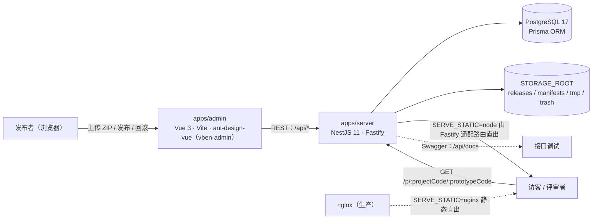

<div align="center">
  

  <h1>ProtoHub · HTML 原型托管平台</h1>

  <p>把 HTML 原型 ZIP 上传发布成可分享的在线链接，按项目 / 原型 / 版本三级管理，支持公开、密码、项目成员三档访问策略与完整的访问统计。</p>

  [](./LICENSE)
  
  
  

  **中文** | [English](./README.md)

  <sub>快速上手：<code>pnpm install</code> → 配置环境变量 → <code>pnpm db:migrate &amp;&amp; pnpm db:seed</code> → <code>pnpm dev</code>，详见下方「快速开始」。</sub>
</div>

---

## 为什么选它

给团队/客户演示 HTML 原型时，常见做法是丢一个 zip 或开一个一次性的静态目录：没法回滚、没法限权、也说不清谁看过。ProtoHub 把这件事产品化：

- **上传即发布**：拖入 HTML 原型 ZIP，立刻得到 `http://…/p/{项目编码}/{原型编码}` 的固定分享链接。
- **版本不可变**：每次发布都是一个快照，随时回滚到任意历史版本，分享链接不变。
- **看得住**：公开访问 / 访问密码 / 仅项目成员三档策略，密码档有解锁限流与 24 小时免重输。
- **看得见**：PV / UV 趋势、被拒次数、爬虫与无效链接统计，按项目、原型、时间范围下钻。

## 功能特性

- **三级模型**：项目 → 原型 → 版本。项目是容器，原型是分享与鉴权的最小单位，版本是不可变快照。
- **发布流水线**：ZIP 流式上传、解包校验（条目数/单文件/总量/压缩比）、生成发布报告，支持追加新版本与传新版本。
- **版本管理**：版本记录、一键回滚、删除版本、下载版本包，归档项目/原型。
- **访问策略**：`public` / `password` / `member` 三档；密码档带门面页、argon2id 存储、解锁 Cookie 与失败限流。
- **访问记录**：PV/UV 日趋势、访问明细（项目/原型/版本/路径/结果/访客/IP/UA/来源）、被拒次数、爬虫请求、无效链接访问，支持筛选与导出。
- **权限体系**：`super_admin` / `admin` / `publisher` / `viewer` 四个内置角色，39 个权限码驱动动态菜单与按钮级控制。
- **管理能力**：用户管理、角色授权、菜单管理、操作日志 / 登录日志、项目成员。
- **工作台**：项目数 / 原型数 / 本周发布次数 / 近 7 天访问量四张统计卡，最近更新的原型与最近动态一屏看完。
- **界面**：亮/暗主题、中英文界面文案、响应式布局。

## 系统截图

| | |
| :---: | :---: |
|  |  |
| **工作台**：统计概览 + 最近原型 + 最近动态 | **上传 HTML 原型**：新建项目与原型一次完成 |

| | |
| :---: | :---: |
|  |  |
| **原型项目**：列表与筛选 | **项目详情**：原型列表、访问地址、项目动态 |

| | |
| :---: | :---: |
|  |  |
| **原型详情**：访问策略、当前版本、版本记录与回滚 | **访问记录**：PV/UV 指标与趋势、访问明细 |

| |
| :---: |
|  |
| **设置**：用户 / 角色 / 菜单 / 日志管理 |

## 架构



- 管理端与访客访问分离：管理接口全部在 `/api` 前缀下，原型静态产物走 `/p/*`，互不干扰。
- 原型产物不入库，落盘在 `STORAGE_ROOT` 下固定子目录；数据库只存项目/原型/版本元数据与访问日志。

## 技术栈

| 层 | 选型 |
| --- | --- |
| 管理端 | Vue 3.5 · Vite 8 · TypeScript 5.9 · ant-design-vue 4 · [vben-admin](https://github.com/vbenjs/vue-vben-admin) 5.7 · ECharts |
| 服务端 | NestJS 11 · Fastify 5 · JWT（access + refresh）· argon2id |
| 数据 | PostgreSQL 17 · Prisma 6（`@protohub/db`） |
| 共享 | `@protohub/shared`（类型契约、权限码常量） |
| 工程 | pnpm workspace · Turborepo · changesets · lefthook + commitlint · Vitest |

## 快速开始

### 环境要求

- Node.js `^22.18.0 || ^24.0.0`（见 `package.json` 的 `engines`）
- pnpm `>= 11.0.0`（仓库 `packageManager` 固定 `pnpm@11.6.0`，建议 `corepack enable`）
- PostgreSQL 17（连接串约定一律写 `127.0.0.1`，**禁止主机名 `localhost`**）

### 安装与初始化

```bash
git clone https://github.com/lq200lq/protohub.git
cd protohub
pnpm install                      # postinstall 会构建 @protohub/shared 与 @protohub/db

# 数据库连接
cp packages/db/.env.example packages/db/.env          # 按需修改 DATABASE_URL

# 服务端配置（四个密钥必须各自用 openssl 生成且互不相同，否则启动校验会拒绝）
cp apps/server/.env.example apps/server/.env
#   openssl rand -base64 48   # 依次填入 JWT_ACCESS_SECRET / JWT_REFRESH_SECRET /
#                             #    SESSION_COOKIE_SECRET / ACCESS_TOKEN_SECRET

pnpm db:migrate                   # 建表（自动检测并创建 *_test 测试库）
pnpm db:seed                      # 内置角色 / 权限码 / 菜单
pnpm db:seed-admin                # 创建超管 admin，随机口令只打印这一次
```

### 启动开发环境

```bash
pnpm dev              # 同时起管理端与服务端；也可以分别用 pnpm dev:admin / pnpm dev:server
```

| 服务 | 地址 |
| --- | --- |
| 管理端 | <http://127.0.0.1:5671>（端口冲突会显式失败，`strictPort`） |
| API 服务 | <http://127.0.0.1:3100> |
| 接口文档 | <http://127.0.0.1:3100/api/docs> |

> 登录账号为 `pnpm db:seed-admin` 打印的 admin 口令（只打印一次，请保存）。只想在本地图省事时，可以运行 `node scripts/reset-admin-password.mjs` 把 admin 口令重置为脚本内的固定值——**仅限本地开发库，切勿用于生产**。
> 前端开发服务器把 `/api` 代理到 `http://127.0.0.1:3100`，无需额外配置。

## 常用命令

| 命令 | 作用 |
| --- | --- |
| `pnpm dev` | 启动管理端 + 服务端开发环境 |
| `pnpm build` | 构建全部产物（Turbo） |
| `pnpm db:migrate` / `db:seed` / `db:seed-admin` / `db:studio` | 迁移 / 种子数据 / 创建超管 / Prisma Studio |
| `pnpm check` | 类型 + 循环依赖 + 一致性 + 测试（提交前的总门禁） |
| `pnpm check:consistency` | 7 条规则校验权限码↔表、菜单↔真实文件等（只读） |
| `pnpm lint` / `pnpm format` | ESLint · Stylelint · Prettier |
| `pnpm test` / `pnpm test:admin` | 全量单测 / 管理端单测 |
| `pnpm smoke` | 端到端冒烟：登录→建项目→发布→三档访问→回滚→归档→查记录 |
| `pnpm bench` | 列表/发布/访问性能基准 |
| `pnpm commit` | 交互式提交（czg + commitlint） |

## 项目结构

```text
protohub/
├── apps/
│   ├── admin/          # 管理端（Vue 3 + vben-admin）
│   └── server/         # API 服务（NestJS + Fastify），/p/* 静态直出
├── packages/
│   ├── db/             # Prisma schema、迁移、种子（角色/权限/菜单）
│   ├── shared/         # 跨端类型契约、权限码常量
│   └── @vben/…         # 框架层包（effects / @core / locales / …）
├── scripts/            # 一致性检查、冒烟、基准、部署与运维脚本
├── docs/               # 设计文档（先读 docs/README.md 的文档地图）
└── assets/             # README 用 banner 与系统截图
```

## 质量保障

- **单测**：服务端 68 个 spec、管理端 8 个 spec，加上 shared / db 测试，`pnpm check:test` 串联执行。
- **一致性门禁**：`pnpm check:consistency` 校验权限码与数据库表、`@RequirePermission` 注解、菜单组件与真实 `.vue` 文件等 7 条规则，防止三处（DB / 后端 / 前端）定义漂移。
- **端到端**：`pnpm smoke` 在独立测试库与端口上跑完整业务链路；`pnpm bench` 给出列表、发布、访问的性能读数。
- **Git 钩子**：lefthook 在 pre-commit 跑 `pnpm lint` + `pnpm check:type`，commit-msg 走 commitlint。

## 文档

完整设计文档在 [`docs/`](./docs/README.md)，建议按下面顺序读：

| 文档 | 内容 |
| --- | --- |
| [平台设计方案](./docs/平台设计方案.md) | 背景、架构、技术选型与里程碑 |
| [原型发布与访问机制](./docs/原型发布与访问机制.md) | ZIP 流水线、安全校验、版本回滚、访问鉴权 |
| [权限模型设计](./docs/权限模型设计.md) | RBAC、内置角色、权限码清单 |
| [数据库设计](./docs/数据库设计.md) | 全部表结构与 DDL |
| [后端接口设计](./docs/后端接口设计.md) | API 契约、统一响应体、错误码 |
| [前端设计](./docs/前端设计.md) | 信息架构、页面清单、状态管理 |
| [部署与运维方案](./docs/部署与运维方案.md) | nginx、pm2、环境变量、上线检查清单 |
| [迭代实施计划](./docs/迭代实施计划.md) | 里程碑与验收 Gate |

## 参与贡献

欢迎 Issue 与 PR！动手前请读 [CONTRIBUTING.md](./CONTRIBUTING.md)（环境准备、提交规范、检查清单），行为规范见 [CODE_OF_CONDUCT.md](./CODE_OF_CONDUCT.md)。

- 报 bug / 提需求：用 [Issue 模板](./.github/ISSUE_TEMPLATE)
- 安全问题：**不要**公开开 issue，请按 [SECURITY.md](./SECURITY.md) 私密上报

## 许可证

本项目采用 [Apache License 2.0](./LICENSE)。

管理端基于 [vue-vben-admin](https://github.com/vbenjs/vue-vben-admin)（MIT）构建，第三方依赖保留其各自的原始许可证。
