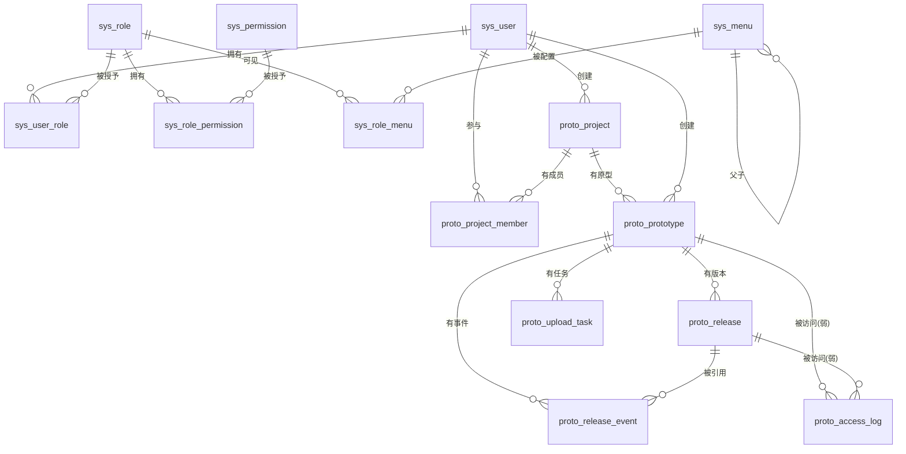

# 数据库设计

> 状态：设计待评审 ｜ 日期：2026-10-06 ｜ 关联：权限模型设计.md、原型发布与访问机制.md §3/§6

目标库：PostgreSQL 17，库名 `protohub`（本机已存在且为空，可直接套用本文 DDL）。开发连接：`postgres/postgres@127.0.0.1:5432/protohub`。

**权威边界**：本文是表结构的**设计权威**（评审、沟通、排障用）。`packages/db/prisma/schema.prisma` 是**可执行权威**（迁移实际来源）。两者的关系是：任何表结构变更**先改本文**，再改 Prisma schema 并生成迁移；两者不一致视为缺陷。

---

## 1. 公共约定

| 项 | 约定 | 说明 |
| --- | --- | --- |
| 主键 | `bigint generated by default as identity` | 不用自增序列裸写，避免权限问题；不用 UUID（本项目不需要跨库合并，bigint 索引更小） |
| 表名/字段名 | 全小写下划线 | 表前缀区分域：`sys_` 权限体系、`proto_` 业务 |
| 时间 | 一律 `timestamptz`，应用层统一按 UTC 存取，展示时按 `Asia/Shanghai` 转 | 禁止 `timestamp without time zone` |
| 软删除 | 需要保号/留痕的表用 `deleted_at timestamptz`；字典类表不用 | 软删除表上的唯一索引一律带 `where deleted_at is null` 条件索引 |
| 审计字段 | `created_by` / `created_at` / `updated_by` / `updated_at` | 字典类表可省 `created_by`/`updated_by` |
| 状态/枚举 | 用 `varchar(20) + check` 约束，**不用 PG 原生 enum** | 加值只需替换 check 约束，避免 `ALTER TYPE ADD VALUE` 不能回退的限制；TS 侧用联合类型 + zod 校验保证类型安全 |
| 布尔 | `boolean not null default false` | 不存 0/1 到 integer |
| IP | `inet` | 便于按网段查询 |
| 金额/大小 | `bigint`（字节） | 不用 `integer`（100MB 包解压后可能 >2GB） |
| 命名 | 唯一索引 `uk_`，普通索引 `idx_`，外键 `fk_` | |
| 字符集 | 库级 UTF8 | 建库时已确定 |

## 2. ER 总览



**三级关系（项目 → 原型 → 版本）是这套设计的骨架**：删除项目级联到原型、原型级联到版本；而"当前生效版本"是原型上的一个指针（`current_release_id`），所以切换/回滚只影响一条链接。

**为什么 `proto_access_log` 到 `proto_prototype` 是弱关联（可空且无外键）**：编码不存在、或原型在请求途中被删除时，日志里根本没有可指向的原型行；那种情况下强行建外键会让日志写入失败（而访问日志绝不该影响访问本身）。同样地 `release_id` 也不建外键——日志是统计事实，不该约束业务删除。`route_key`（形如 `crm/crm-p01`）保证即使 `prototype_id` 为空也能定位到访问的是哪条路径。这是全库唯一两处刻意不建外键的关联。

## 3. 表清单

| # | 表名 | 中文名 | 软删除 | 说明 |
| --- | --- | --- | --- | --- |
| 1 | `sys_user` | 用户 | ✓ | |
| 2 | `sys_role` | 角色 | ✓ | |
| 3 | `sys_user_role` | 用户-角色 | ✗ | 关系表 |
| 4 | `sys_permission` | 权限码字典 | ✗ | 与代码常量同步 |
| 5 | `sys_role_permission` | 角色-权限 | ✗ | 关系表 |
| 6 | `sys_menu` | 菜单/按钮树 | ✗ | 驱动前端动态路由 |
| 7 | `sys_role_menu` | 角色-菜单 | ✗ | 关系表 |
| 8 | `sys_login_log` | 登录日志 | ✗ | 保留 180 天 |
| 9 | `sys_oper_log` | 操作日志 | ✗ | 保留 180 天 |
| 10 | `proto_project` | 项目 | ✓ | 容器，管归档与成员范围 |
| 11 | `proto_prototype` | 原型 | ✓ | **分享与鉴权的最小单位** |
| 12 | `proto_project_member` | 项目成员 | ✗ | 数据权限依据 |
| 13 | `proto_release` | 发布版本 | ✓ | 不可变快照，挂在原型下 |
| 14 | `proto_release_event` | 版本事件 | ✗ | 发布/回滚时间线 |
| 15 | `proto_upload_task` | 上传任务 | ✗ | 异步发布 |
| 16 | `proto_access_log` | 访问记录 | ✗ | 保留 180 天 |

## 4. 表结构 DDL

### 4.1 权限体系（`sys_`）

```sql
-- 4.1.1 用户
create table sys_user (
  id                    bigint generated by default as identity primary key,
  username              varchar(50)  not null,
  password_hash         text         not null,              -- argon2id
  real_name             varchar(50)  not null,
  email                 varchar(120),
  phone                 varchar(20),
  avatar                varchar(500),
  status                smallint     not null default 1,     -- 1 启用 / 0 禁用
  token_version         integer      not null default 0,     -- 会话撤销用，见权限模型设计 §5.4
  force_password_change boolean      not null default false,  -- 首登强制改密
  auth_provider         varchar(20)  not null default 'local',-- local|ldap|sso（预留 Q-5）
  last_login_at         timestamptz,
  last_login_ip         inet,
  remark                varchar(200),
  created_by            bigint,
  created_at            timestamptz  not null default now(),
  updated_by            bigint,
  updated_at            timestamptz  not null default now(),
  deleted_at            timestamptz
);
create unique index uk_sys_user_username on sys_user (lower(username)) where deleted_at is null;
create index idx_sys_user_status on sys_user (status) where deleted_at is null;

-- 4.1.2 角色
create table sys_role (
  id         bigint generated by default as identity primary key,
  code       varchar(50) not null,                          -- super_admin|admin|publisher|viewer|自定义
  name       varchar(50) not null,
  data_scope varchar(20) not null default 'member'
             check (data_scope in ('all','member','own')),   -- 多角色取最宽
  built_in   boolean     not null default false,             -- 内置角色 code 不可改、不可删（C-1）
  sort       integer     not null default 0,
  status     smallint    not null default 1,
  remark     varchar(200),
  created_at timestamptz not null default now(),
  updated_at timestamptz not null default now(),
  deleted_at timestamptz
);
create unique index uk_sys_role_code on sys_role (code) where deleted_at is null;

-- 4.1.3 用户-角色
create table sys_user_role (
  user_id    bigint not null references sys_user (id) on delete cascade,
  role_id    bigint not null references sys_role (id) on delete cascade,
  created_at timestamptz not null default now(),
  primary key (user_id, role_id)
);
create index idx_sys_user_role_role on sys_user_role (role_id);

-- 4.1.4 权限码字典（与代码常量同步，见权限模型设计 §3）
create table sys_permission (
  id         bigint generated by default as identity primary key,
  code       varchar(80) not null,                          -- proto:prototype:publish
  name       varchar(80) not null,
  module     varchar(50) not null,                          -- dashboard|proto|system
  sort       integer     not null default 0,
  created_at timestamptz not null default now(),
  updated_at timestamptz not null default now()
);
create unique index uk_sys_permission_code on sys_permission (code);

-- 4.1.5 角色-权限
create table sys_role_permission (
  role_id       bigint not null references sys_role (id) on delete cascade,
  permission_id bigint not null references sys_permission (id) on delete cascade,
  created_at    timestamptz not null default now(),
  primary key (role_id, permission_id)
);
create index idx_sys_role_permission_perm on sys_role_permission (permission_id);

-- 4.1.6 菜单/按钮树（驱动 /menu/all 与前端动态路由）
create table sys_menu (
  id           bigint generated by default as identity primary key,
  pid          bigint references sys_menu (id) on delete restrict,
  type         varchar(20) not null
               check (type in ('catalog','menu','button','embedded','link')),
  name         varchar(80) not null,                        -- 路由 name（PascalCase，全局唯一）
  title        varchar(80) not null,                        -- 显示标题
  path         varchar(200),                                -- 路由 path（button 为空）
  component    varchar(200),                                -- 相对 apps/admin/src/views 的路径，或 'BasicLayout'/'IFrameView'
  auth_code    varchar(80),                                 -- button 携带的权限码
  icon         varchar(80),                                 -- iconify 名，如 lucide:folder-code
  sort         integer     not null default 0,              -- → meta.order
  status       smallint    not null default 1,              -- 1 启用 / 0 停用（停用不下发）
  keep_alive   boolean     not null default false,
  affix_tab    boolean     not null default false,
  hide_in_menu boolean     not null default false,
  menu_visible_with_forbidden boolean not null default false,
  authority    varchar(200),                                -- 逗号分隔角色，→ meta.authority
  ignore_access boolean    not null default false,
  open_in_new_window boolean not null default false,
  iframe_src   varchar(500),
  link_url     varchar(500),
  badge        varchar(20),
  badge_type   varchar(20),
  created_at   timestamptz not null default now(),
  updated_at   timestamptz not null default now()
);
create unique index uk_sys_menu_name on sys_menu (name);
create unique index uk_sys_menu_auth_code on sys_menu (auth_code) where auth_code is not null;
create index idx_sys_menu_pid on sys_menu (pid, sort);

-- 4.1.7 角色-菜单
create table sys_role_menu (
  role_id bigint not null references sys_role (id) on delete cascade,
  menu_id bigint not null references sys_menu (id) on delete cascade,
  primary key (role_id, menu_id)
);
create index idx_sys_role_menu_menu on sys_role_menu (menu_id);

-- 4.1.8 登录日志
create table sys_login_log (
  id          bigint generated by default as identity primary key,
  user_id     bigint,
  username    varchar(50) not null,
  login_type  varchar(20) not null default 'login'
              check (login_type in ('login','logout','refresh_fail')),
  success     boolean     not null,
  fail_reason varchar(120),
  ip          inet,
  user_agent  varchar(500),
  created_at  timestamptz not null default now()
);
create index idx_sys_login_log_user on sys_login_log (user_id, created_at desc);
create index idx_sys_login_log_created on sys_login_log (created_at);

-- 4.1.9 操作日志（审计）
create table sys_oper_log (
  id            bigint generated by default as identity primary key,
  user_id       bigint,
  username      varchar(50),
  module        varchar(50) not null,
  action        varchar(50) not null,                       -- create|update|delete|publish|rollback|policy...
  resource_type varchar(50),                                -- project|release|user|role|menu
  resource_id   varchar(64),
  resource_name varchar(200),
  method        varchar(10),
  path          varchar(300),
  detail        jsonb,                                      -- 变更差异，必须脱敏
  ip            inet,
  success       boolean     not null default true,
  error_message varchar(500),
  duration_ms   integer,
  created_at    timestamptz not null default now()
);
create index idx_sys_oper_log_resource on sys_oper_log (resource_type, resource_id, created_at desc);
create index idx_sys_oper_log_created on sys_oper_log (created_at);
```

> `detail` 脱敏规则（硬约束）：不写 `password_hash`、不写访问密码明文、不写 refreshToken、不写完整 accessToken。密码类变更只记 `{"password_changed": true}`。

### 4.2 业务（`proto_`）

```sql
-- 4.2.1 项目（原型的容器）
-- 项目状态不落库，由原型聚合派生（决策 D-22）：
--   已归档 = archived_at 非空
--   已发布 = archived_at 为空 且 存在 status='published' 的原型
--   草稿   = archived_at 为空 且 不存在 status='published' 的原型
create table proto_project (
  id          bigint generated by default as identity primary key,
  name        varchar(80) not null,
  code        varchar(63) not null
              check (code ~ '^[a-z0-9]+(-[a-z0-9]+)*$'),     -- 项目编码，访问路径第一段
  description varchar(500),
  archived_at timestamptz,                                   -- 非空 = 已归档（项目层唯一的状态字段）
  created_by  bigint not null references sys_user (id),
  created_at  timestamptz not null default now(),
  updated_by  bigint,
  updated_at  timestamptz not null default now(),
  deleted_at  timestamptz
);
create unique index uk_proto_project_code on proto_project (code) where deleted_at is null;
create index idx_proto_project_created_by on proto_project (created_by) where deleted_at is null;
create index idx_proto_project_archived on proto_project (archived_at);

-- 4.2.2 原型（一条可独立分享的访问链接 + 它的版本历史）
create table proto_prototype (
  id                 bigint generated by default as identity primary key,
  project_id         bigint not null references proto_project (id) on delete cascade,
  name               varchar(80) not null,
  code               varchar(63) not null
                     check (code ~ '^[a-z0-9]+(-[a-z0-9]+)*$'),  -- 原型编码，访问路径第二段（项目内唯一）
  description        varchar(500),
  status             varchar(20) not null default 'draft'
                     check (status in ('draft','published','archived')),
  access_mode        varchar(20) not null default 'public'
                     check (access_mode in ('public','password','member')),
  password_hash      text,                                   -- access_mode='password' 必填（argon2id）
  policy_version     integer not null default 1,             -- 改模式/改密码时 +1，旧解锁 cookie 立即失效（D-07）
  current_release_id bigint,                                 -- 外键在 4.2.4 之后补，避免循环依赖
  sort               integer not null default 0,             -- 项目内展示顺序
  first_published_at timestamptz,
  published_at       timestamptz,                            -- 当前生效版本的生效时间（回滚也会更新）
  archived_at        timestamptz,
  created_by         bigint not null references sys_user (id),
  created_at         timestamptz not null default now(),
  updated_by         bigint,
  updated_at         timestamptz not null default now(),
  deleted_at         timestamptz,
  constraint ck_proto_prototype_pwd
    check (access_mode <> 'password' or password_hash is not null)
);
create unique index uk_proto_prototype_code on proto_prototype (project_id, code) where deleted_at is null;
create index idx_proto_prototype_project on proto_prototype (project_id, sort);
create index idx_proto_prototype_status on proto_prototype (status) where deleted_at is null;

-- 4.2.3 项目成员（数据权限依据；范围停在项目层，项目内原型随项目可见）
create table proto_project_member (
  project_id  bigint not null references proto_project (id) on delete cascade,
  user_id     bigint not null references sys_user (id) on delete cascade,
  member_role varchar(20) not null default 'viewer'
              check (member_role in ('owner','editor','viewer')),
  created_by  bigint,
  created_at  timestamptz not null default now(),
  primary key (project_id, user_id)
);
create index idx_proto_project_member_user on proto_project_member (user_id);

-- 4.2.4 发布版本（不可变快照；挂在原型下）
create table proto_release (
  id           bigint generated by default as identity primary key,
  prototype_id bigint not null references proto_prototype (id) on delete cascade,
  version_no   integer not null,                            -- 原型内递增，从 1 开始
  status       varchar(20) not null default 'ready'
               check (status in ('ready','broken','deleted')),
  storage_key  varchar(300) not null,                       -- releases/{projectId}/{prototypeId}/{releaseId}
  entry_file   varchar(200) not null default 'index.html',
  source_hash  varchar(64)  not null,                        -- 上传 zip 的 sha256
  content_hash varchar(64)  not null,                        -- 产物指纹（文件清单排序后再 sha256）
  source_size  bigint       not null,                        -- zip 字节数
  file_count   integer      not null,
  total_bytes  bigint       not null,
  manifest     jsonb        not null default '{}'::jsonb,
  note         varchar(300),
  created_by   bigint not null references sys_user (id),
  created_at   timestamptz not null default now(),
  deleted_at   timestamptz
);
create unique index uk_proto_release_version on proto_release (prototype_id, version_no);
create index idx_proto_release_prototype on proto_release (prototype_id, created_at desc);
create index idx_proto_release_hash on proto_release (prototype_id, source_hash);

-- 循环外键：原型 → 当前生效版本
alter table proto_prototype
  add constraint fk_proto_prototype_current_release
  foreign key (current_release_id) references proto_release (id) on delete set null;

-- 4.2.5 版本事件（发布/回滚时间线）
-- 不冗余 project_id：project 通过 prototype 关联（prototype 不会跨项目迁移，join 结果稳定）
create table proto_release_event (
  id              bigint generated by default as identity primary key,
  prototype_id    bigint not null references proto_prototype (id) on delete cascade,
  event_type      varchar(20) not null
                  check (event_type in ('publish','rollback','unpublish','republish','delete_version')),
  from_release_id bigint,
  to_release_id   bigint,
  operator_id     bigint not null references sys_user (id),
  reason          varchar(300),
  created_at      timestamptz not null default now()
);
create index idx_proto_release_event_prototype on proto_release_event (prototype_id, created_at desc);

-- 4.2.6 上传任务（异步发布）
-- prototype_id 非空：轻校验通过后、创建任务之前，先在同一事务里落库 project/prototype
-- （原型为 draft）。好处见发布机制文档 §3.1，核心是"失败后表单不用重填、编码被提前占住"。
create table proto_upload_task (
  id            bigint generated by default as identity primary key,
  prototype_id  bigint not null references proto_prototype (id) on delete cascade,
  status        varchar(20) not null default 'pending'
                check (status in ('pending','processing','success','failed','canceled')),
  progress      smallint not null default 0
                check (progress between 0 and 100),
  stage         varchar(30),                                -- validating|extracting|postprocess|committing
  source_name   varchar(300) not null,
  source_size   bigint not null,
  temp_key      varchar(300),
  release_id    bigint,
  error_code    varchar(40),
  error_message varchar(500),
  warnings      jsonb not null default '[]'::jsonb,
  created_by    bigint not null references sys_user (id),
  created_at    timestamptz not null default now(),
  started_at    timestamptz,
  finished_at   timestamptz
);
create index idx_proto_upload_task_todo on proto_upload_task (status, created_at)
  where status in ('pending','processing');
create index idx_proto_upload_task_prototype on proto_upload_task (prototype_id, created_at desc);

-- 4.2.7 访问记录
-- prototype_id 可空且不建外键：
--   ① 编码不存在 / 已归档被拒的请求没有对应的原型，必须允许为空；
--   ② 请求在途中原型被删除时不应因外键失败而丢日志。
-- 也因此按项目筛选访问记录要 join proto_prototype，prototype_id 为空的行属于"无效链接访问"。
create table proto_access_log (
  id           bigint generated by default as identity primary key,
  prototype_id bigint,
  release_id   bigint,                                      -- 刻意不建外键，见 §2 说明
  route_key    varchar(140) not null,                       -- 形如 crm/crm-p01，用于无原型时也能定位
  path         varchar(500) not null,
  result       varchar(20) not null
               check (result in ('ok','denied_401','denied_403','not_found')),
  user_id      bigint,                                      -- member 档已登录时记录
  ip           inet,
  ua           varchar(500),
  browser      varchar(40),
  os           varchar(40),
  device       varchar(20),                                 -- desktop|mobile|tablet|bot
  referer      varchar(500),
  is_bot       boolean not null default false,
  created_at   timestamptz not null default now()
);
create index idx_proto_access_log_prototype on proto_access_log (prototype_id, created_at desc);
create index idx_proto_access_log_created on proto_access_log (created_at);
```

## 5. 索引与约束的设计说明

| 索引/约束 | 服务的查询 | 为什么这样设计 |
| --- | --- | --- |
| `uk_proto_project_code ... where deleted_at is null` | 按项目编码查项目（每次访问原型的第一步） | 条件唯一索引让"软删除后编码可复用"，同时不影响在用编码的唯一性 |
| `uk_proto_prototype_code (project_id, code)` | 按"项目编码 + 原型编码"查原型（**访问热路径**，每次静态请求都要走） | 原型编码只需项目内唯一，所以索引前导列是 `project_id`；这一条是整库最热的两条查询之一（另一条是 `proto_access_log` 的插入） |
| `idx_proto_project_created_by` | `data_scope=own` 的列表过滤 | 带 `where deleted_at is null` 减少索引体积 |
| `idx_proto_prototype_project (project_id, sort)` | 项目详情里的原型列表 | 覆盖"取某项目的原型并按顺序排" |
| `uk_proto_release_version (prototype_id, version_no)` | version_no 递增（取 max+1）、版本列表 | 唯一约束是并发上传的最终防线：两个并发发布抢同一 version_no 时其中一个必然失败并重试 |
| `idx_proto_release_hash (prototype_id, source_hash)` | 上传后判断"这个包在这个原型上是不是已经发过" | 去重范围是原型而不是项目（同一份包发给两个原型是正常需求） |
| `idx_proto_upload_task_todo`（部分索引） | Worker 拉取待处理任务 | 只索引 pending/processing，任务表即使堆积历史记录也不会拖慢拉取 |
| `idx_proto_access_log_prototype` | 访问记录按原型查、工作台 Top 原型 | `(prototype_id, created_at desc)` 覆盖最常见的"某原型最近记录" |
| `idx_proto_access_log_created` | 定时 GC 按时间删 | GC 用 `delete ... where created_at < ?` 走此索引 |
| `ck_proto_prototype_pwd` | 数据完整性 | 保证 `access_mode='password'` 时不可能没有密码（应用层漏判也拦得住） |
| `proto_access_log.prototype_id / release_id` 无外键 | 无效链接访问、删除旧版本 | 见 §2 说明；代价是可能指向已删对象，展示时左连接并降级显示"版本已删除" |

**项目状态筛选（`archived_at is null` + EXISTS 子查询）**：项目列表按状态筛选需要 `exists (select 1 from proto_prototype p where p.project_id = t.id and p.status = 'published' and p.deleted_at is null)`。这让列表查询比单表稍重，但走 `idx_proto_prototype_project` 后仍是索引扫描。选它是因为"项目状态落库"需要在每次原型发布/归档时同步更新项目行，是一处必然出 bug 的重复真相（决策 D-22）。

**未加索引但被讨论过的点**：项目/原型名称与编码的模糊搜索（列表页的搜索框）用 `ILIKE '%kw%'`。项目量在 1 万以内全表扫描完全可接受（表宽小），因此**一期不引入 `pg_trgm` 扩展**；若项目数超过 5 万再加 `gin (name gin_trgm_ops)`（记入平台设计方案 §11 R-2 的观察项）。

## 6. 初始化数据

初始化脚本必须**幂等**（可重复执行），放在 `deploy/init/`，由 Prisma seed 调用。执行顺序：权限码 → 角色 → 角色权限 → 菜单 → 角色菜单 → 超级管理员。

### 6.1 权限码

完整清单见 [权限模型设计.md](./权限模型设计.md) §3，共 4 组（权限码已按"项目/原型"两级拆开）。脚本从 `packages/shared/src/constants/permissions.ts` 这个**代码常量文件**生成（避免两份手写清单漂移）：

```ts
// packages/shared/src/constants/permissions.ts（节选，全量见权限模型设计 §3）
export const PERMISSIONS = [
  { code: 'dashboard:workspace:view',    name: '工作台首页', module: 'dashboard' },
  { code: 'proto:project:list',          name: '项目列表',   module: 'proto' },
  { code: 'proto:prototype:create',      name: '新建原型',   module: 'proto' },
  { code: 'proto:prototype:publish',     name: '上传发布',   module: 'proto' },
  { code: 'proto:prototype:rollback',    name: '版本回滚',   module: 'proto' },
  { code: 'proto:prototype:policy',      name: '访问策略',   module: 'proto' },
  // ... 其余按权限模型设计 §3 一一对应
] as const;

// 编码生成规则（D-20）也放这里，前后端共用同一份
export const CODE_RULE = { pattern: /^[a-z0-9]+(-[a-z0-9]+)*$/, maxLength: 63 };
export const genProjectCode = () => `p-${randomBase36(8)}`;              // 项目：随机
export const genPrototypeCode = (projectCode: string, seq: number) =>    // 原型：项目码 + 序号
  `${projectCode}-p${String(seq).padStart(2, '0')}`;
// 注意：项目编码也是自动生成时，原型编码形如 `p-7f3k9m2x-p01`（能工作但不好念）。
// 这是"原型码 = 项目码 + 序号"与小概率项目码随机的组合结果，不是缺陷；
// 界面要在提交前把这个结果预览给用户（前端设计 §3.4），让他有机会回来手填一个好念的项目码。
```

### 6.2 角色与权限分配

```sql
insert into sys_role (code, name, data_scope, built_in, sort, remark) values
  ('super_admin', '超级管理员', 'all',    true, 1, '拥有全部权限，不可删除'),
  ('admin',       '平台管理员', 'all',    true, 2, '除菜单管理与角色授权外的全部权限'),
  ('publisher',   '发布者',     'member', true, 3, '可发布/回滚自己参与的项目'),
  ('viewer',      '只读访客',   'member', true, 4, '只读项目信息与访问记录')
on conflict (code) do update set name = excluded.name, data_scope = excluded.data_scope;

-- super_admin：全部权限码
insert into sys_role_permission (role_id, permission_id)
select r.id, p.id from sys_role r cross join sys_permission p
where r.code = 'super_admin'
on conflict do nothing;

-- admin：除 system:menu:* 与 system:role:assignperm 之外全部
insert into sys_role_permission (role_id, permission_id)
select r.id, p.id from sys_role r cross join sys_permission p
where r.code = 'admin'
  and p.code not like 'system:menu:%'
  and p.code <> 'system:role:assignperm'
on conflict do nothing;

-- publisher / viewer：按权限模型设计 §4 的清单，用显式 code 列表 insert（略，脚本中以数组常量给出）
```

### 6.3 菜单树

对齐原型图的侧边栏（工作台 / 原型项目 / 访问记录 / 设置），采用**扁平一级菜单**（不用二级目录），与截图一致。层级体现在**页面内部**（项目列表 → 点项目进详情看原型列表 → 点原型进详情看版本），而不是侧边栏嵌套：

| name | type | path | component | 图标 | sort | 权限码 / 备注 |
| --- | --- | --- | --- | --- | --- | --- |
| `Workspace` | menu | `/dashboard/workspace` | `/dashboard/workspace/index` | `lucide:layout-dashboard` | 1 | `affixTab=true`，标题「工作台」 |
| `ProtoProject` | menu | `/proto/project` | `/proto/project/index` | `lucide:folder-code` | 2 | 标题「原型项目」 |
| `ProtoProjectCreate` | button | — | — | — | — | `proto:project:create` |
| `ProtoProjectUpdate` | button | — | — | — | — | `proto:project:update` |
| `ProtoProjectDelete` | button | — | — | — | — | `proto:project:delete` |
| `ProtoProjectArchive` | button | — | — | — | — | `proto:project:archive` |
| `ProtoProjectDetail` | menu | `/proto/project/detail` | `/proto/project/detail/index` | — | 3 | `hideInMenu=true`（从列表进，不做侧栏入口） |
| `ProtoPrototypeCreate` | button | — | — | — | — | `proto:prototype:create` |
| `ProtoPrototypeUpdate` | button | — | — | — | — | `proto:prototype:update` |
| `ProtoPrototypeDelete` | button | — | — | — | — | `proto:prototype:delete` |
| `ProtoPrototypeArchive` | button | — | — | — | — | `proto:prototype:archive` |
| `ProtoPrototypePolicy` | button | — | — | — | — | `proto:prototype:policy` |
| `ProtoPrototypePublish` | button | — | — | — | — | `proto:prototype:publish` |
| `ProtoPrototypeRollback` | button | — | — | — | — | `proto:prototype:rollback` |
| `ProtoPrototypeDetail` | menu | `/proto/prototype/detail` | `/proto/prototype/detail/index` | — | 4 | `hideInMenu=true`（**访问链接与版本历史的落点**） |
| `ProtoAccessLog` | menu | `/proto/accesslog` | `/proto/accesslog/index` | `lucide:chart-line` | 6 | 标题「访问记录」 |
| `SystemSetting` | menu | `/system/setting` | `/system/setting/index` | `lucide:settings` | 99 | 标题「设置」，页内以 Tabs 承载用户/角色/菜单/日志 |
| `SystemUserManage` | button | — | — | — | — | `system:user:list` |
| `SystemRoleManage` | button | — | — | — | — | `system:role:list` |
| `SystemMenuManage` | button | — | — | — | — | `system:menu:list` |
| `SystemLogView` | button | — | — | — | — | `system:log:list` |
| `Profile` | menu | `/profile` | `/_core/profile/index` | — | 100 | `hideInMenu=true`，从右上头像菜单进入 |

> 按钮节点的 `pid` 指向最近的页面节点：项目级按钮挂在 `ProtoProject` 下，原型级按钮挂在 `ProtoPrototypeDetail` 下（原型操作入口都在原型详情与项目详情的原型行上）。角色授权界面按这棵树渲染勾选。

`component` 的取值规则（来自 vben 实现实测）：菜单的 `component` 会被拼到 `apps/admin/src/views/**/*.vue` 的 glob 上，路径需以 `/` 开头且**不含 `/views` 前缀**（`normalizeViewPath` 会剥掉 `/views`）。因此数据库里写 `/proto/project/index`，对应文件 `apps/admin/src/views/proto/project/index.vue`。写错时 vben 会打印 `route component is invalid` 并落到 404 组件——排障时先看浏览器控制台这条日志。

### 6.4 首个超级管理员

```bash
# 由部署脚本执行，密码随机生成并打印到部署日志；首次登录强制改密
node dist/scripts/seed-admin.js --username admin
# 输出示例：created user "admin" with initial password: Xy7#k2Pq...（仅打印一次）
```

脚本逻辑：若已存在任一 `super_admin` 用户则跳过（幂等）；否则创建用户、绑定 `super_admin` 角色、写 `sys_login_log` 一条 `success=false, fail_reason='initial seed'` 便于审计追溯。

## 7. 迁移与版本管理

| 项 | 约定 |
| --- | --- |
| 迁移工具 | `prisma migrate`；迁移文件入库（`packages/db/prisma/migrations/`） |
| 迁移命名 | `yyyyMMddHHmm_简述`，由 Prisma 自动生成时间戳 + 手工补简述 |
| 破坏性变更 | 删列/改类型必须先走"加新列 → 双写 → 回填 → 切读 → 删旧列"多步迁移，禁止一步到位 |
| 与本文的同步 | 迁移 PR 必须同时改本文 §4，CI 可加检查（比对 Prisma 生成的 DDL 与本文代码块差异，非强制，作为提醒） |
| 生产执行 | 迁移在部署流程中自动执行（`prisma migrate deploy`），失败即中止部署 |
| 回滚 | 每个迁移必须评估可回滚性；不可回滚的迁移要在 PR 描述与本文中写明 |

## 8. 容量与保留策略

| 表 | 增长估算 | 保留策略 |
| --- | --- | --- |
| `sys_*` | 极小（用户/角色/菜单都在百级） | 永久 |
| `proto_project` | 每年数百 | 永久（软删除） |
| `proto_prototype` | 每年数百~数千（每项目下若干个） | 永久（软删除） |
| `proto_release` | 与发布次数同阶（每年数千） | 元数据永久保留，其**产物文件**按保留策略 GC |
| `proto_release_event` | 与发布/回滚次数同阶 | 永久（是审计依据） |
| `proto_upload_task` | 与上传次数同阶，失败记录会累积 | 保留 90 天，定时清理 |
| `proto_access_log` | **最大表**：假设日活 200 次入口访问 → 每年 7 万行，十年 70 万行，单表无压力；若单原型对外引流（日万级）需关注 | 保留 180 天，每日 03:00 定时删除过期行；单表超过 2000 万行时改按 `created_at` 月分区（P1） |
| `sys_login_log` / `sys_oper_log` | 小 | 保留 180 天 |

**磁盘（产物）保留策略**（与 `proto_release` 元数据分离，详见 [原型发布与访问机制.md](./原型发布与访问机制.md) §4.3）：

1. 每个原型**当前生效的版本**永不删除。
2. 每个**原型**保留最近 5 个版本（可配置），且至少保留最近 30 天内的所有版本。**保留计数按原型算，不按项目算**——否则一个项目里原型多了，每个原型能留的版本会被挤到 1 个，回滚能力形同虚设。
3. 超出的旧版本：`status='deleted'` + `deleted_at`，产物目录延迟 7 天再物理删除（给误删留恢复窗口）。
4. 删除原型时：先标记原型 `deleted_at`，产物目录整体在 7 天后由 GC 清理（`rm -rf releases/{projectId}/{prototypeId}`）。
5. 删除项目时：级联标记其下全部原型，产物按上一条逐原型清理。
